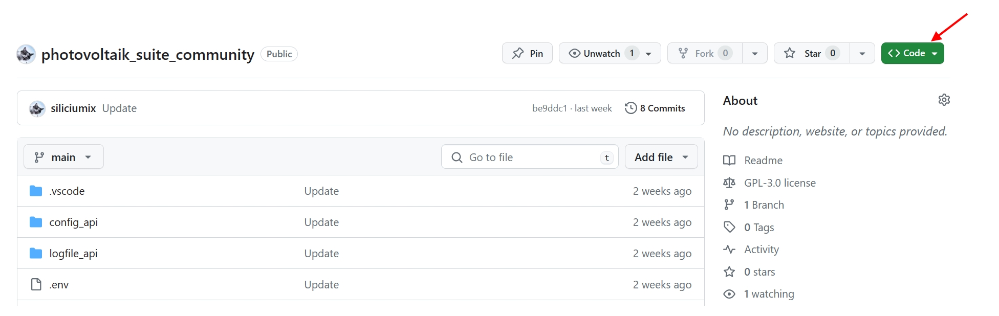
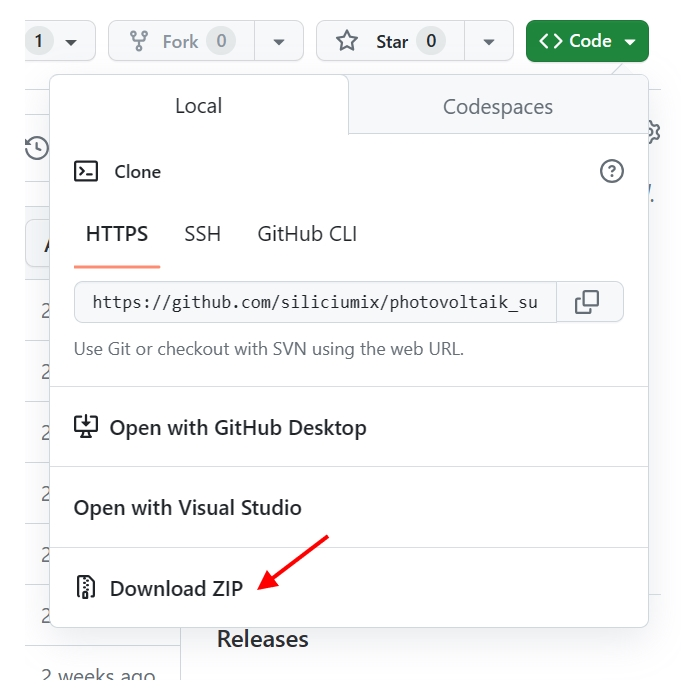
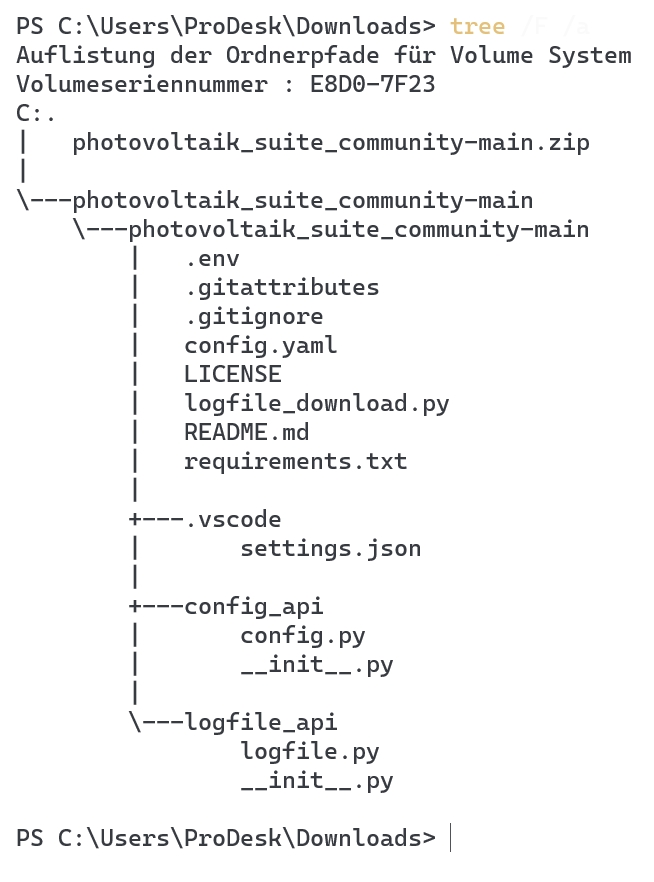

# Photovoltaik Logfile Downloader 

#### community editions

## Python installieren

### Windows

Bei der Installation von Python müsst ihr darauf achten das **PIP** ebenfalls installiert wird.


### Git Repository herunterladen

Da ich jetzt schon oft mitbekommen habe, dass die Dateien des Repositories einzeln heruntergeladen werden, hier eine kleine Anleitung. Oben rechts befindet sich ein grüner Button mit der Beschriftung `<> Code` 



Dann bekommt man ein kleines Fenster, in dem ganz unten die Möglichkeit angezeigt wird, das Ganze per ZIP herunterzuladen.



Diese wird in eurem Download-Ordner gespeichert. Als nächstes wird die ZIP-Datei ausgepackt, und man erhält folgende Ordnerstruktur.



Hier sind die korrigierten Sätze:

Jetzt kann man den inneren Ordner (photovoltaik_suite_community-main) umbenennen und an eine andere Stelle des Dateisystems verschieben. Danach ruft man die PowerShell auf und wechselt in den Ordner (photovoltaik_suite_community-main oder wie auch immer man ihn umbenannt hat).

Dann passt man die `config.yaml` an. Dabei ist zu beachten, dass man sich genau an das Schema hält. Es sollten keine Zeichen hinzugefügt werden oder einfach das Datumsformat geändert werden.


---
 **ACHTUNG**

Unbedingt den folgenden Befehl ausführen, um alle benötigten Module zu installieren. Auf die Idee zu kommen, einfach nach ähnlichen Modulen zu suchen, ist keine gute Option. Das funktioniert definitiv nicht.

```
pip install -r requirements.txt
```

### Starten des Downloaders

Der Downloader darf nur aus dem Hauptverzeichnis in dem sich die Datei `logfile_download.py` befindet aufgerufen werden. Gilt nur für den Standardfall. Sollte jemand irgendwelche Pfade auf seinem System verbogen haben gelten die folgenden Befehle evtl. nicht und führen zu einem Fehler. 

#### Windows

```
python logfile_download.py
```

#### Linux

```
python3 logfile_download.py
```

#### Angebissener Apfel

Mit Fallobst, das Strom benötigt, habe ich keine Erfahrung und kann daher nichts dazu sagen.

NEIN, wir rufen es nicht mit 'py logfile_download.py' auf, das ist ungünstig und kann zu Fehlern führen.

Es dürfen auf gar keinen Fall Dateien verschoben oder umbenannt werden.

---

## Konfiguration anpassen

Im Bereich "Speicher" muss die IP-Adresse des Speichers angegeben werden. Es darf kein "HTTP" oder "HTTPS" oder ähnliches davor angegeben werden, da dies automatisch durch das Skript erfolgt. Ebenso darf auch kein Pfad zu den Logfiles angegeben werden, denn auch das geschieht automatisch durch das Skript.

Der Bereich "Logfiles" bezieht sich ausschließlich auf den Logfile Downloader, da diese Konfigurationsdatei auch für weitere Skripte verwendet wird. Hier sollte das "startDatum" angepasst werden, um festzulegen, ab welchem Tag die Logfiles heruntergeladen werden sollen. Bei der ersten Verwendung ist das idealerweise das Inbetriebnahme Datum.

Mit der Einstellung "pfardart" legt man fest, wo die Logfiles gespeichert werden sollen. Dies geschieht relativ zum gerade ausgeführten Skript, welches "logfile.py" ist. Wenn wir "pfardart" mit "../logfiles" festlegen, bedeutet das, dass die Logfiles in einem Unterverzeichnis namens "logfiles" geschrieben werden, welches eine Ebene höher liegt.

```
├ logfile_downloader
├── config_api
├── logfile_api
       ├── __init__.py
       ├── logfile.py
├── config_api
├── logfiles
├── config.yaml 
/
```

Mit der Einstellung **Suffix** legen wir die Endung unseres Logfiles fest.

Die Einstellung **SortYear** legt fest, dass die Logfiles nach Jahren sortiert werden. Wenn bei **SortMonth** "yes" angegeben wird, werden die Logfiles zusätzlich nach Monaten sortiert.

Wenn man **Cronjob** auf "yes" setzt, wird das Startdatum übergangen, und es wird nur das Logfile des aktuellen Tages heruntergeladen. Stellt man gleichzeitig **Yester** auf "yes", wird das Logfile vom Vortag heruntergeladen.

Damit kann man beispielsweise einen Cronjob unter Linux einrichten, der jeden Tag um 0:15 Uhr startet und sicherstellt, dass man das gesamte Logfile vom Vortag erhält.

Bei **Sleep** handelt es sich um eine Kompatibilitätseinstellung. Sollte der Webserver des Speichers mal nicht hinterherkommen, führt das zu einem Fehler. Sollten mehr Fehler als unter **ErrorCount** angegeben auftreten, wird für x Sekunden gewartet und der Webserver des Speichers entlastet.


